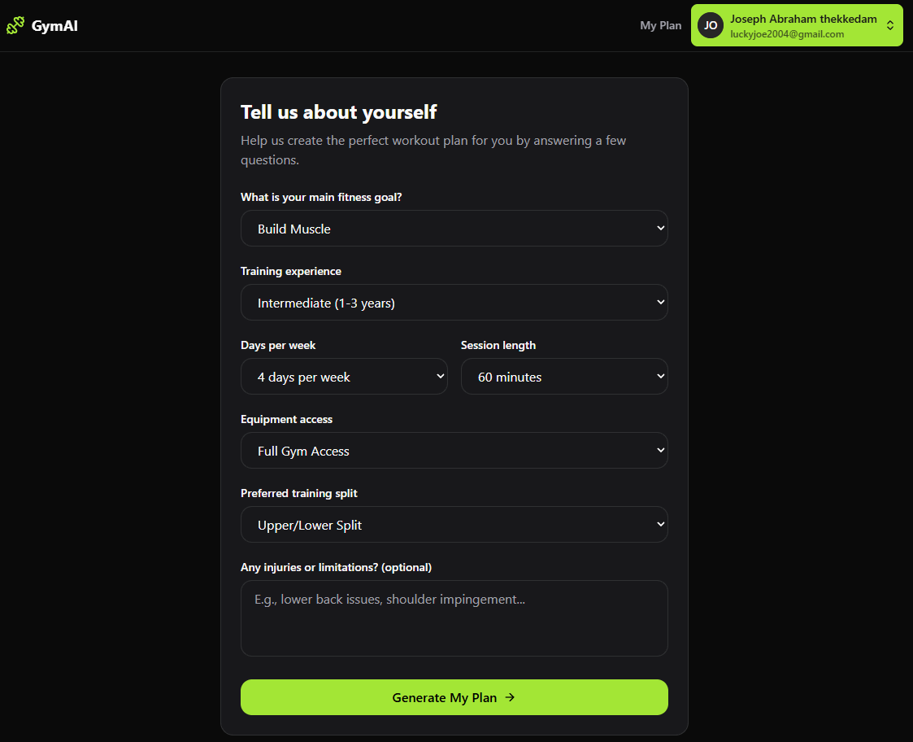
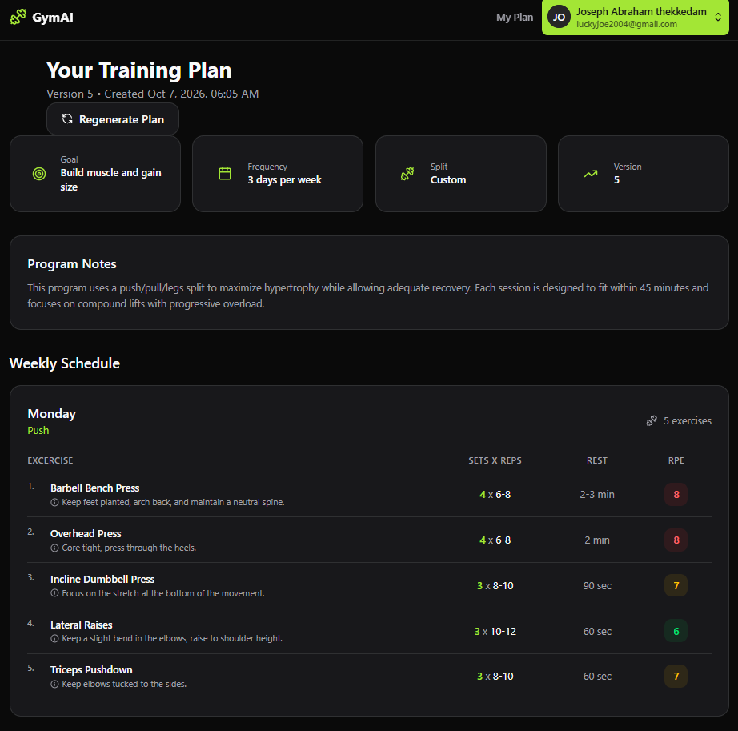
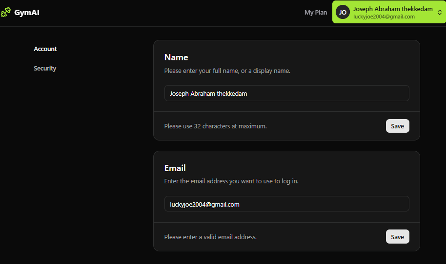

# AI Gym Planner

This repository contains a full-stack AI fitness application built using **React, TypeScript, Express and PostgreSQL**.

The application allows users to create a fitness profile and generate personalised workout plans using AI based on their goals, experience and training preferences.

## Project Overview

The application includes:

- User authentication
- Protected routes
- Fitness profile onboarding
- Persistent user data
- AI-generated workout plans
- REST API communication between the frontend and backend
- Responsive interface built with Tailwind CSS

User information is stored in a **Neon PostgreSQL** database and used by the backend to generate personalised training plans.

## Screenshots

### Home Page


### Onboarding



### Generated Training Plan



### Profile Page



## AI Workout Generation

The Express backend integrates with **OpenRouter** to generate personalised workout programmes.

Information collected during onboarding is sent to the backend and used to generate a training plan based on the user's fitness profile and preferences.

The generated plan is returned through the REST API and displayed in the React frontend.

## Authentication

Authentication is implemented using **Neon Auth**.

Protected routes prevent unauthenticated users from accessing profile and training plan functionality, while authenticated users can store data associated with their account.

## REST API

The backend is built using **Express, Node.js and TypeScript**.

Example API endpoints include:

```text
POST /api/profile
POST /api/plan/generate
```

The profile endpoint stores onboarding information, while the plan endpoint generates a personalised workout plan using the stored user data.

## Database

The application uses **Neon PostgreSQL** for persistent storage of:

- User profiles
- Fitness goals
- Training preferences
- Generated workout plans

## Technologies

### Frontend

- React
- TypeScript
- Vite
- Tailwind CSS

### Backend

- Node.js
- Express
- TypeScript
- REST APIs

### Database and Services

- PostgreSQL
- Neon
- Neon Auth
- OpenRouter

## Installation

Clone the repository:

```bash
git clone <repository-url>
cd GymAI
```

Install the frontend dependencies from the project root:

```bash
npm install
```

Then install the backend dependencies:

```bash
cd server
npm install
```

## Environment Variables

The frontend `.env` file is located in the project root.

Configure the required frontend environment variables, including the backend API URL:

```env
VITE_API_URL=http://localhost:3001
```

The backend environment variables should be configured inside the `server` directory.

These should include the required **Neon database**, **authentication** and **OpenRouter** credentials.

For example:

```env
DATABASE_URL=YOUR_NEON_DATABASE_CONNECTION_STRING
OPENROUTER_API_KEY=YOUR_OPENROUTER_API_KEY
```

Environment variable files should not be committed to GitHub.

## Running the Project

The frontend and backend should be run in separate terminals.

### Start the Backend

From the project root:

```bash
cd server
npm run dev:server
```

The Express server runs on:

```text
http://localhost:3001
```

### Start the Frontend

Open another terminal from the project root and run:

```bash
npm run dev
```

Open the local URL displayed by Vite in your browser.

## How It Works

1. The user signs in using Neon Auth.
2. The user completes the fitness onboarding form.
3. The React frontend sends the profile data to the Express API.
4. The backend stores the profile in Neon PostgreSQL.
5. The user requests a personalised workout plan.
6. The backend sends the relevant profile data to OpenRouter.
7. The generated workout plan is returned and displayed to the user.

## Acknowledgements

This project was developed while following PedroTech's **Full-Stack AI Gym Planner** course on YouTube.

The course was used as a learning resource for the core full-stack architecture and implementation.

Course:
https://www.youtube.com/watch?v=upo7BBbomoQ


## Author

Joseph Abraham Thekkedam
